---

---

💻 &nbsp;Computer & Systems Engineering student 
⚡ &nbsp;Building web apps, cloud pipelines, and AI-powered tools 
🤖 &nbsp;Currently exploring Claude, MCP servers, and local LLMs (Qwen, OpenLLAMA) 
💬 &nbsp;Ask me about: **React · Spring Boot · AWS · Claude API**  
&nbsp;

---

## 🚀 Tech Stack

**Frontend**

**Backend**

**Cloud & DevOps**

**AI & Tools**

-6b21a8?logo=ollama&logoColor=white&style=flat-square)

---

## 📊 GitHub Stats

&nbsp;&nbsp;

  

  

---

